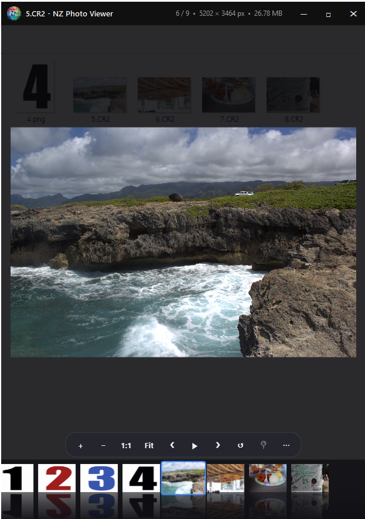
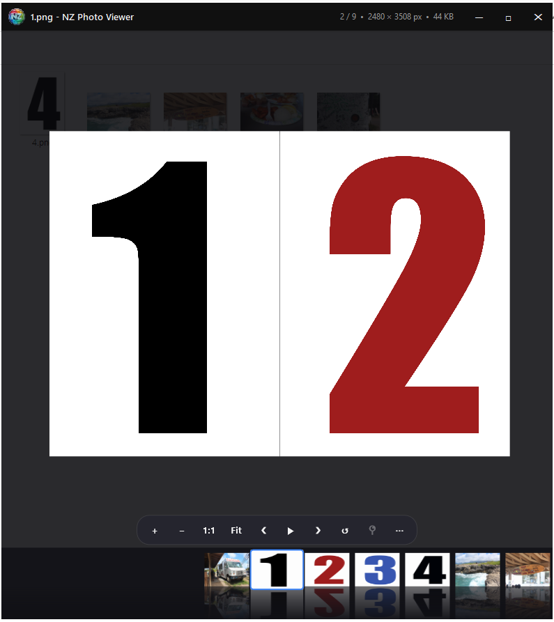
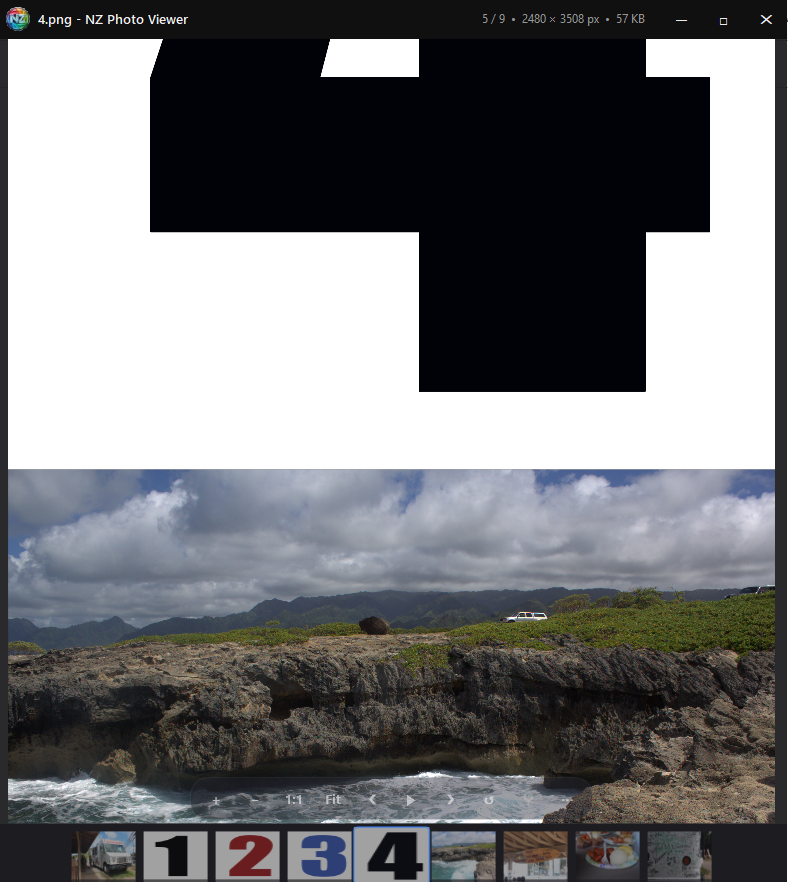
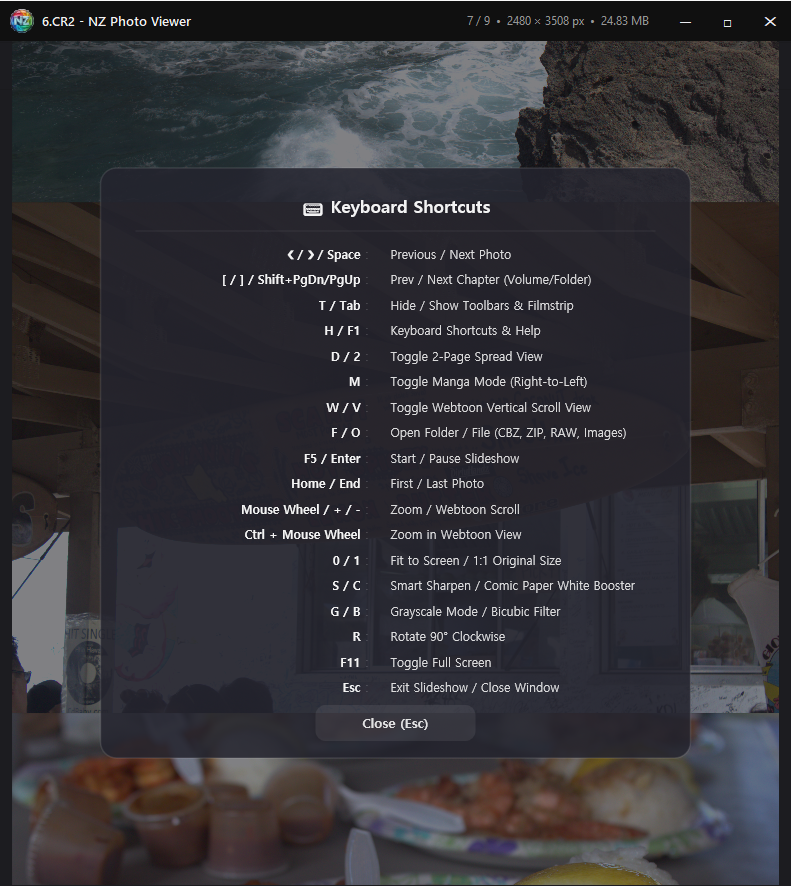
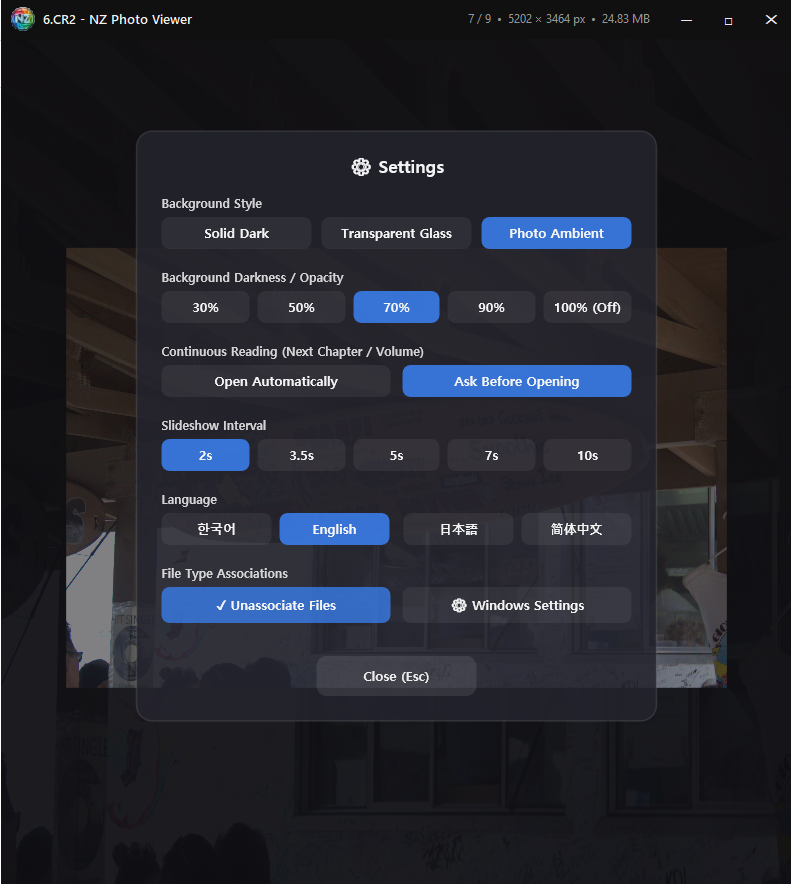

# NZ View

A lightweight, blazing-fast image, comic, and webtoon viewer for Windows 10 & 11, powered by **Direct2D GPU acceleration** and inspired by the classic soul of **Google Picasa**.

---

## 📸 Screenshots

### 1. Modern Glass Photo Viewer

### 2. Dual-Page Manga Reading Mode (Right-to-Left)

### 3. Webtoon Continuous Vertical Scroll Mode

### 4. Comprehensive Shortcuts & Help

### 5. Settings & One-Click File Associations

---

## 📥 Download

Download the latest version from the **[Releases](https://github.com/NZTools-Dev/NZView/releases)** page:

- **Setup Installer (Recommended)**: `NZ_View_Setup.exe` (1-second fast install with Windows file associations)
- **Portable 64-bit**: `NZView_Portable_x64.zip` (No installation needed)
- **Portable 32-bit**: `NZView_Portable_x86.zip`

---

## ✨ Key Highlights

- **Direct2D GPU Acceleration**: Smooth 60fps hardware-accelerated rendering with physics-based spring animations for ultra-high-resolution images.
- **Webtoon Infinite Scroll**: Seamless vertical strip view with 0px seams, real-time strip width scaling (`Ctrl + Wheel`), and on-screen jump buttons.
- **Dual-Page Spread & Manga RTL**: Authentic right-to-left comic reading with smart automatic 2-page pairing.
- **Direct Comic Archive Support**: Open `CBZ` and `ZIP` archives instantly on the fly without extracting files.
- **Smart Context Profiles**: Automatically adapts UI layout and viewing modes when switching between comics and photos.
- **Touch-Style Swipe Gestures**: Swipe through images with smooth mouse drag physics.
- **Smart Continuous Reading**: Automatically detects volume and chapter numbers (`Vol.01`, `Ep.02`) to seamlessly advance to the next volume upon reaching the end.
- **Real-Time Quality Enhancement Filters**:
  - `S` : Smart Sharpening (Restores clear text and lines on blurry scans)
  - `C` : Comic Paper White Booster (Cleans yellowed backgrounds into crisp pure white)
  - `G` : Clean Grayscale Mode (Removes color compression noise)
  - `B` : High-Quality Bicubic Filter (Smooth anti-aliased interpolation)
- **Multilingual Support**: Fully localized in English, Korean, Japanese, and Simplified Chinese.

---

## ⌨️ Essential Keyboard Shortcuts

| Hotkey | Action |
| :--- | :--- |
| **❮ / ❯ / Space** | Previous / Next Image |
| **[ / ]** (or `Shift + PgDn/Up`) | Previous / Next Chapter / Volume |
| **T / Tab** | Toggle Clean View (Hide / Show Toolbars & Filmstrip) |
| **H / F1** | Open Keyboard Shortcuts & Help Modal |
| **D / 2** | Toggle 2-Page Spread / Single Page View |
| **M** | Toggle Manga Mode (Right-to-Left / Left-to-Right) |
| **W / V** | Toggle Webtoon Vertical Scroll View |
| **F / O** | Open Folder / Open File (`CBZ`, `ZIP`, `RAW`, Images) |
| **S / C** | Smart Sharpen / Comic Paper White Booster |
| **G / B** | Clean Grayscale Mode / High-Quality Bicubic Filter |
| **F5 / Enter** | Start / Pause Slideshow |
| **Ctrl + Mouse Wheel** | Zoom Webtoon Strip Width |
| **0 / 1** | Fit to Screen / 1:1 Original Size |
| **R** | Rotate 90° Clockwise |
| **F11 / Esc** | Toggle Fullscreen / Close Dialog |

---

## 📂 Supported Formats (28+ Formats)

- **Comics & Archives**: `CBZ`, `ZIP`
- **Standard Images**: `JPG`, `JPEG`, `PNG`, `WEBP`, `GIF`, `BMP`, `ICO`, `TIFF`, `PSD`, `HDR`, `SVG`, `HEIC`, `AVIF`, `JXL`
- **Camera RAW**: `CR2`, `CR3`, `NEF`, `ARW`, `DNG`, `ORF`, `RW2`, `PEF`, `RAF`

---

## 📜 License

- **Freeware**: Free for personal, commercial, and educational use.
- **Official Blog**: [NZTools-Dev (https://nztool.blogspot.com/)](https://nztool.blogspot.com/)

© 2026 **NZTools-Dev**. All rights reserved.
